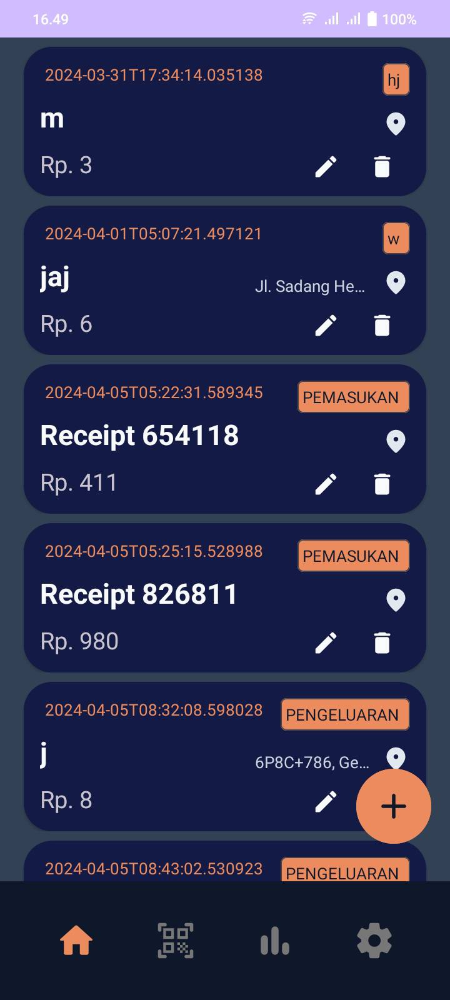
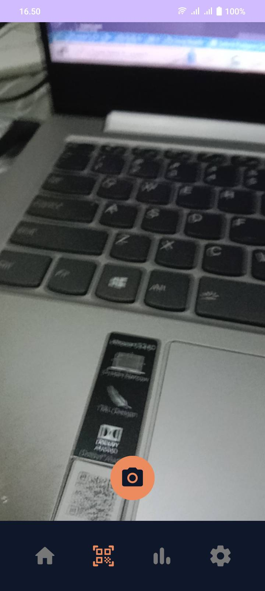
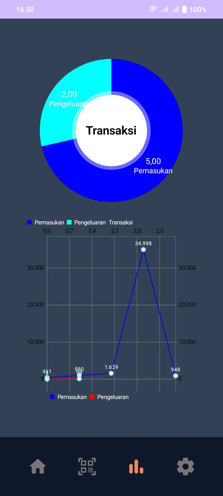
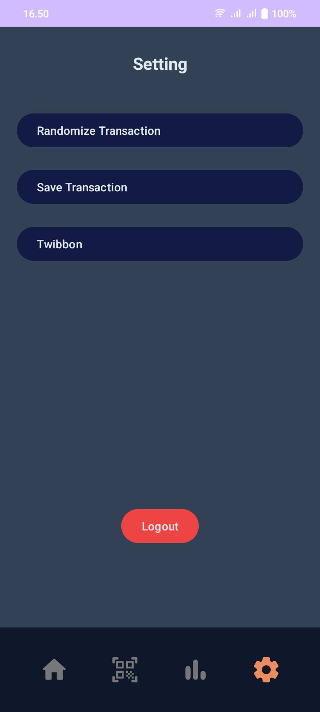
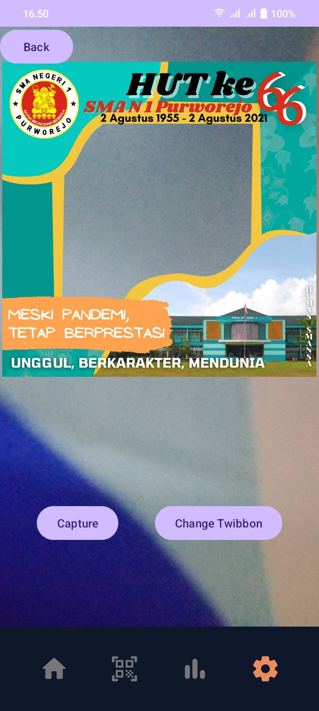

# BondoMan

BondoMan adalah sebuah aplikasi manajemen keuangan yang membantu pengguna dalam mencatat dan mengelola transaksi keuangan mereka. Dengan fitur-fitur yang lengkap, BondoMan memudahkan pengguna untuk melakukan pencatatan transaksi, melakukan scan nota, melihat grafik rangkuman transaksi, dan masih banyak lagi.

## Library yang Digunakan
- androidx
- Room
- Material Design Components
- Lifecycle
- Navigation Component
- Google Play Services Maps
- EasyPermissions
- MPAndroidChart
- Apache POI
- CameraX
- Retrofit

## Screenshot Aplikasi

### Login

  

### Daftar Transaksi

  

### Scanner

  

### Graph

  

### Setting

  

### Twibbon

  

### Tambah transaksi

  

## Pembagian Kerja Anggota Kelompok
- Puspa Nilasari
  - Melakukan implementasi fitur login.
  - Melakukan implementasi fitur logout.

- Mutawally Nawwar
  - Mengatur tampilan header dan navbar sesuai dengan menu yang dipilih.
  - Mengembangkan fitur tampilan grafik rangkuman transaksi.
  - Melakukan styling layout aplikasi.

- Ulung Adi Putra
  - Melakukan implementasi fitur cek background service.
  - Mengimplementasikan fitur penambahan, pengubahan, dan penghapusan transaksi.
  - Mengimplementasikan daftar transaksi dan lokasi pada transaksi.
  - Mengimplementasikan simpan transaksi ke excel.
  - Mengelola penyimpanan dan akses data transaksi menggunakan Room.

- M. Dimas Sakti Widyatmaja
  - Mengimplementasikan fitur pengiriman transaksi melalui email menggunakan Gmail Intent.
  - Menangani fitur scan nota dan pengelolaan gambar.
  - Menyusun tampilan dan logika untuk fitur twibbon.

## Jumlah Jam Persiapan dan Pengerjaan
- 10023562 - Puspa Nilasari: 15 jam
- 13521065 - Mutawally Nawwar: 28 jam
- 13521122 - Ulung Adi Putra: 30 jam
- 13521160 - M. Dimas Sakti Widyatmaja: 20 jam
